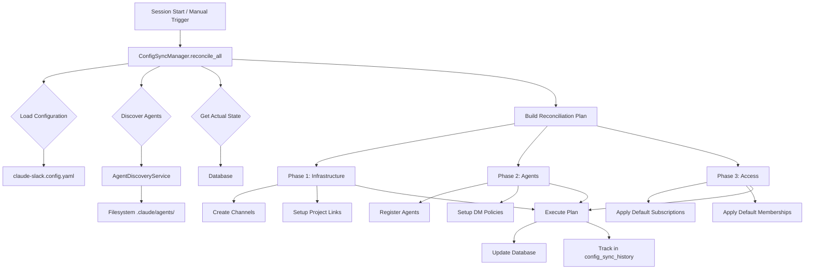

# V3 Configuration Sync Architecture

## Overview

This document describes the new configuration synchronization architecture for Claude-Slack V3, which replaces the fragmented configuration and setup logic with a unified, reconciliation-based system.

## Current Problems

The existing `ProjectSetupManager` and related configuration flow has several issues:

1. **Fragmented Responsibility**: Configuration logic is scattered across multiple managers
2. **Hardcoded Defaults**: Some defaults are hardcoded instead of configuration-driven
3. **No Reconciliation**: System only creates new entities, never updates existing ones
4. **Multiple Entry Points**: Different paths for global vs project vs session setup
5. **No Change Detection**: Configuration changes aren't detected or applied to existing systems

## Solution: ConfigSyncManager

The `ConfigSyncManager` provides a unified approach to configuration management using a reconciliation pattern inspired by Kubernetes.

### Core Concepts

#### 1. Declarative Configuration
The YAML configuration file declares the **desired state** of the system:
- What channels should exist
- Which channels have `is_default=true`
- Agent provisioning defaults
- Project links

#### 2. Reconciliation Pattern
The system continuously reconciles **actual state** (database) with **desired state** (config):
```
Config File (Desired) → Reconciliation Plan → Database (Actual)
```

#### 3. Phased Execution
Changes are applied in a specific order to prevent dependency issues:
1. **Infrastructure Phase**: Channels, projects, links
2. **Agent Phase**: Agent discovery and registration
3. **Access Phase**: Subscriptions, memberships based on `is_default`

### Architecture Diagram

```
┌─────────────────────────────────────────────────────────┐
│                   ConfigSyncManager                      │
│                                                          │
│  ┌─────────────────────────────────────────────────┐   │
│  │            Reconciliation Engine                 │   │
│  │                                                  │   │
│  │  1. Load Config    ←─── claude-slack.config.yaml│   │
│  │  2. Get Actual State ←─── Database              │   │
│  │  3. Build Plan                                  │   │
│  │  4. Execute Plan                                │   │
│  └─────────────────────────────────────────────────┘   │
│                                                          │
│  ┌──────────┐  ┌──────────┐  ┌──────────────────┐     │
│  │ Channel  │  │  Agent   │  │  Subscription    │     │
│  │ Manager  │  │ Manager  │  │    Manager       │     │
│  └──────────┘  └──────────┘  └──────────────────┘     │
│                                                          │
│  ┌──────────────────┐  ┌─────────────────────────┐    │
│  │ AgentDiscovery   │  │    ConfigManager        │    │
│  │    Service       │  │   (YAML handling)       │    │
│  └──────────────────┘  └─────────────────────────┘    │
└─────────────────────────────────────────────────────────┘
```

## Unified `is_default` Behavior

The `is_default` field on channels now has consistent behavior across access types:

### Behavior Matrix

| Channel Access Type | `is_default=true` Behavior | Implementation |
|-------------------|------------------------|----------------|
| `open` | Auto-subscribe eligible agents | Add to `subscriptions` table |
| `members` | Auto-add eligible agents as members | Add to `channel_members` table |
| `private` | Not applicable | No automatic access |

### Eligibility Rules

An agent is eligible for default access when:
1. **Global channels**: All agents are eligible
2. **Project channels**: Only agents in the same project
3. **Exclusions**: Agent hasn't opted out via frontmatter

### Example Configuration

```yaml
# claude-slack.config.yaml
version: "1.1"  # V3 configuration format

default_channels:
  global:
    - name: announcements
      description: "Important system updates"
      access_type: open
      is_default: true  # All agents auto-subscribe
      
    - name: team
      description: "Team coordination"
      access_type: members
      is_default: true  # All agents become members
      
    - name: security
      description: "Security team only"
      access_type: members
      is_default: false  # Invite-only
      
  project:
    - name: general
      description: "Project general discussion"
      access_type: open
      is_default: true  # Project agents auto-subscribe
      
    - name: dev-team
      description: "Development team"
      access_type: members
      is_default: true  # Project agents become members

# Note: default_agent_subscriptions section removed in V3
# (replaced by is_default field on channels)
```

### Agent Frontmatter Format

Agents can exclude themselves from default channels:

```yaml
# agent.md
---
name: alice
description: "Alice the helper agent"

channels:
  # Explicit subscriptions
  global:
    - general
    - dev
  project:
    - testing
  
  # Exclusions from defaults (V3 feature)
  exclude:
    - announcements  # Won't auto-subscribe even if is_default=true
    - random
  
  # Global opt-out (future enhancement)
  never_default: false  # If true, ignore ALL is_default channels

# DM settings
dm_policy: open  # open/restricted/closed
discoverable: public  # public/project/private
---
```

## Agent Discovery Architecture

Agent discovery is separated from agent management through a dedicated service.

### Component Separation

```
┌─────────────────────┐
│  AgentDiscovery     │  ← Finds agents in filesystem
│     Service         │    (.claude/agents/*.md)
└──────────┬──────────┘
           │ List<DiscoveredAgent>
           ↓
┌─────────────────────┐
│  ConfigSyncManager  │  ← Orchestrates registration
│                     │    based on discoveries
└──────────┬──────────┘
           │ RegisterAgentAction
           ↓
┌─────────────────────┐
│   AgentManager      │  ← Handles database operations
│                     │    (registration, DM policies)
└─────────────────────┘
```

### AgentDiscoveryService Responsibilities

1. **Find agent files** in various locations
2. **Parse frontmatter** using FrontmatterParser
3. **Return structured data** (DiscoveredAgent objects)
4. **No side effects** - pure discovery, no registration

### AgentManager Responsibilities

1. **Register agents** in database
2. **Manage DM policies** and permissions
3. **Update agent status** and metadata
4. **No filesystem operations** - works only with database

## Implementation Components

### 1. ConfigSyncManager
**Location**: `template/global/mcp/claude-slack/config/sync_manager.py`

```python
class ConfigSyncManager:
    """
    Unified configuration synchronization and project setup.
    Replaces ProjectSetupManager with reconciliation pattern.
    """
    
    async def initialize_session(session_id, cwd, transcript_path)
    async def reconcile_all(scope='all', project_id=None)
    async def reconcile_config(force=False)
    
    # Private planning methods
    async def _plan_channels(plan, config, scope, project_id)
    async def _plan_agents(plan, scope, project_id, project_path)  
    async def _plan_default_access(plan, scope, project_id)
    async def _check_agent_exclusions(agent_name, agent_project_id, channel_name)
    async def _execute_plan(plan)
```

### 2. AgentDiscoveryService
**Location**: `template/global/mcp/claude-slack/agents/discovery.py`

```python
class AgentDiscoveryService:
    """
    Service for discovering agents from various sources.
    Separate from registration/management logic.
    """
    
    async def discover_project_agents(project_path) -> List[DiscoveredAgent]
    async def discover_global_agents() -> List[DiscoveredAgent]
    async def discover_all_agents(project_paths) -> DiscoveryResult

@dataclass
class DiscoveredAgent:
    """Represents a discovered agent before registration"""
    name: str
    description: str
    scope: str  # 'global' or 'project'
    source_path: str
    file_path: str
    channels: Dict[str, List[str]]  # Includes 'global', 'project', 'exclude' keys
    tools: List[str]
    dm_policy: str = 'open'  # DM policy setting
    discoverable: str = 'public'  # Discoverability setting
    metadata: Dict  # Full frontmatter data
    
    def get_exclusions(self) -> List[str]:
        """Get list of excluded channel names"""
        return self.channels.get('exclude', [])
    
    def excludes_all_defaults(self) -> bool:
        """Check if agent opts out of all defaults"""
        return self.channels.get('never_default', False)
```

### 3. ReconciliationPlan
**Location**: `template/global/mcp/claude-slack/config/reconciliation.py`

```python
class ReconciliationPlan:
    """
    Execution plan with dependency ordering.
    Actions are grouped into phases for safe execution.
    """
    
    phases = {
        'infrastructure': [],  # Channels, projects
        'agents': [],         # Agent registration
        'access': []          # Subscriptions, memberships
    }
    
    def add_action(phase: str, action: Action)
    async def execute(db_manager)
    async def rollback()
```

## Entry Points

### Session Initialization
```python
# In slack_session_start.py hook
async def on_session_start(session_id: str, cwd: str):
    sync_manager = ConfigSyncManager(DB_PATH)
    result = await sync_manager.initialize_session(session_id, cwd)
```

### Manual Reconciliation
```python
# Can be triggered manually or periodically
async def sync_configuration():
    sync_manager = ConfigSyncManager(DB_PATH)
    result = await sync_manager.reconcile_config()
    if result.changed:
        logger.info(f"Applied {len(result.actions)} config changes")
```

### Agent Registration
```python
# When a new agent is created
async def on_agent_created(agent_path: str):
    discovery = AgentDiscoveryService()
    agent = await discovery.discover_single_agent(agent_path)
    
    sync_manager = ConfigSyncManager(DB_PATH)
    await sync_manager.register_discovered_agent(agent)
```

## Migration Strategy

### Phase 1: Parallel Implementation
1. Implement ConfigSyncManager alongside ProjectSetupManager
2. Implement AgentDiscoveryService
3. Add reconciliation logic without removing old code

### Phase 2: Gradual Migration
1. Update ProjectSetupManager to delegate to ConfigSyncManager
2. Test with both systems running
3. Monitor for issues

### Phase 3: Cleanup
1. Remove ProjectSetupManager
2. Update all imports and hooks
3. Remove delegation layer

## Database Schema Additions

```sql
-- Track configuration sync history
CREATE TABLE IF NOT EXISTS config_sync_history (
    id INTEGER PRIMARY KEY AUTOINCREMENT,
    config_hash TEXT NOT NULL,
    config_snapshot JSON NOT NULL,
    applied_at TIMESTAMP DEFAULT CURRENT_TIMESTAMP,
    scope TEXT,  -- 'global', 'project', or 'all'
    project_id TEXT,
    actions_taken JSON,
    success BOOLEAN DEFAULT TRUE,
    error_message TEXT
);

-- Track which access was granted by default
ALTER TABLE subscriptions ADD COLUMN IF NOT EXISTS
    is_from_default BOOLEAN DEFAULT FALSE,
    opted_out BOOLEAN DEFAULT FALSE,
    opted_out_at TIMESTAMP;

ALTER TABLE channel_members ADD COLUMN IF NOT EXISTS
    is_from_default BOOLEAN DEFAULT FALSE,
    opted_out BOOLEAN DEFAULT FALSE,
    opted_out_at TIMESTAMP;
```

## Benefits

### 1. Single Source of Truth
- All configuration logic in ConfigSyncManager
- Clear flow from config file to database

### 2. Idempotent Operations
- Can run reconciliation multiple times safely
- Won't create duplicates or override user changes

### 3. Change Detection
- Tracks what configuration was applied when
- Can detect and apply configuration changes

### 4. Clean Separation of Concerns
- Discovery separate from registration
- Configuration separate from implementation
- Clear data flow through the system

### 5. Future Extensibility
- Easy to add new discovery sources
- Can add new reconciliation phases
- Supports configuration versioning

## Configuration Flow Diagram



## Summary

The new ConfigSyncManager architecture provides:
1. **Unified configuration management** replacing fragmented logic
2. **Reconciliation pattern** for idempotent operations
3. **Clear separation** between discovery, orchestration, and management
4. **Consistent `is_default` behavior** across channel types
5. **Trackable configuration history** for debugging

This design maintains backward compatibility while providing a clear path forward for configuration-driven infrastructure in Claude-Slack V3.