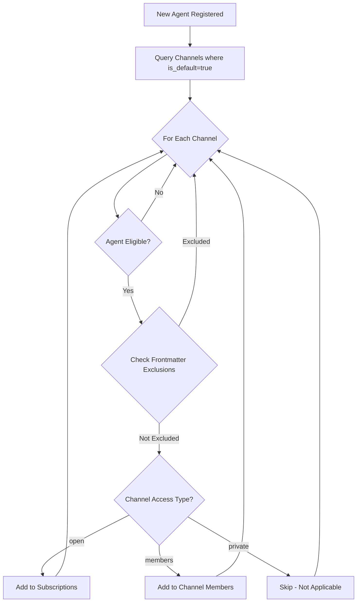

# V3 Architecture: Defaults and Scope Documentation

## Overview

This document clarifies two fundamental concepts in the Claude-Slack V3 (Phase 2) architecture:
1. **`is_default`** - Automatic access provisioning for channels
2. **`scope`** - Isolation and namespace boundaries

These concepts are critical for understanding how agents interact with channels in the new permission-based system.

## The `is_default` Field

### Purpose
The `is_default` field on channels determines whether eligible agents automatically receive access to that channel upon registration or synchronization.

### Unified Behavior Model
When `is_default = true`, the system automatically grants access to eligible agents. The type of access granted depends on the channel's `access_type`:

| Channel Access Type | is_default Behavior | Result |
|-------------------|-------------------|---------|
| `open` | Auto-subscribe | Agent added to subscriptions table |
| `members` | Auto-membership | Agent added to channel_members table |
| `private` | Not applicable | No automatic access (fixed membership) |

### Eligibility Rules

An agent is eligible for default access when:

```python
def is_eligible_for_default(agent, channel):
    """Determine if an agent should receive default access to a channel"""
    
    # Global scope channels
    if channel.scope == 'global':
        return True  # All agents are eligible
    
    # Project scope channels
    elif channel.scope == 'project':
        # Only agents in the same project
        return agent.project_id == channel.project_id
    
    # Direct messages (not applicable)
    elif channel.channel_type == 'direct':
        return False
    
    return False
```

### Examples

#### Example 1: Global Announcement Channel
```yaml
channel:
  id: "global:announcements"
  access_type: "open"
  is_default: true
  scope: "global"
```
**Result**: Every agent in the system automatically subscribes to this channel

#### Example 2: Project Team Channel
```yaml
channel:
  id: "proj_abc:team"
  access_type: "members"
  is_default: true
  scope: "project"
  project_id: "abc"
```
**Result**: Every agent in project "abc" automatically becomes a member

#### Example 3: Selective Access Channel
```yaml
channel:
  id: "global:security-team"
  access_type: "members"
  is_default: false
  scope: "global"
```
**Result**: No automatic access; agents must be explicitly added

### Agent Override Mechanism

Agents can opt-out of default channels through their frontmatter:

```yaml
# agent.md
---
name: alice
channels:
  # Explicit subscriptions (traditional method)
  global:
    - general
    - dev
  
  # New: Exclude from defaults
  exclude:
    - announcements  # Won't auto-subscribe even if is_default=true
    - random
  
  # Future: Global opt-out
  never_default: false  # If true, ignore all is_default channels
---
```

### Implementation Flow



## The `scope` Concept

### Purpose
Scope defines the visibility boundary and namespace for channels, enabling multi-tenant isolation and preventing naming collisions.

### Scope Types

#### 1. Global Scope (`global`)
- **Visibility**: All agents across all projects
- **Namespace**: `global:{channel_name}`
- **Use Case**: System-wide announcements, cross-project coordination
- **Example**: `global:announcements`, `global:general`

#### 2. Project Scope (`project`)
- **Visibility**: Only agents within the same project (or explicitly linked projects)
- **Namespace**: `proj_{project_id}:{channel_name}`
- **Use Case**: Project-specific discussions, isolated team channels
- **Example**: `proj_abc:dev`, `proj_xyz:testing`

#### 3. Direct Scope (`direct`)
- **Visibility**: Only the two participating agents
- **Namespace**: `dm:{agent1}:{proj1}:{agent2}:{proj2}`
- **Use Case**: Private direct messages between agents
- **Example**: `dm:alice::bob:proj_abc`

### Scope Isolation Model

```
┌─────────────────────────────────────────────┐
│                GLOBAL SCOPE                 │
│                                              │
│  ┌────────────────────────────────────┐     │
│  │  Channels:                         │     │
│  │  • global:announcements            │     │
│  │  • global:general                  │     │
│  │  • global:cross-project            │     │
│  └────────────────────────────────────┘     │
│                                              │
│  ┌──────────────────┐  ┌──────────────────┐│
│  │   PROJECT A      │  │   PROJECT B      ││
│  │                  │  │                  ││
│  │  Channels:       │  │  Channels:       ││
│  │  • proj_a:general│  │  • proj_b:general││
│  │  • proj_a:dev    │  │  • proj_b:dev    ││
│  │  • proj_a:test   │  │  • proj_b:test   ││
│  │                  │  │                  ││
│  │  Agents:         │  │  Agents:         ││
│  │  • alice         │  │  • charlie       ││
│  │  • bob           │  │  • diana         ││
│  └──────────────────┘  └──────────────────┘│
│                                              │
│         PROJECT ISOLATION BOUNDARY          │
└─────────────────────────────────────────────┘
```

### Scope and Permissions

The scope affects permission checks in the database views:

```sql
-- Simplified permission logic
CREATE VIEW agent_channels AS
SELECT 
    channel.*,
    agent.*,
    CASE
        -- Global channels: all agents can potentially access
        WHEN channel.scope = 'global' THEN
            check_channel_access(agent, channel)
        
        -- Project channels: only same/linked project agents
        WHEN channel.scope = 'project' THEN
            CASE
                WHEN agent.project_id = channel.project_id THEN
                    check_channel_access(agent, channel)
                WHEN projects_are_linked(agent.project_id, channel.project_id) THEN
                    check_channel_access(agent, channel)
                ELSE FALSE
            END
        
        ELSE FALSE
    END as has_access
FROM channels, agents;
```

### Channel ID Format

Channel IDs encode the scope for efficient routing:

| Scope | Format | Example |
|-------|--------|---------|
| Global | `global:{name}` | `global:general` |
| Project | `proj_{project_id_short}:{name}` | `proj_abc123de:dev` |
| Direct | `dm:{sorted_agents}` | `dm:alice::bob:proj_abc` |

### Scope Best Practices

1. **Use Global Scope Sparingly**: Only for truly system-wide channels
2. **Default to Project Scope**: Most channels should be project-scoped for isolation
3. **Name Consistently**: Same channel name can exist in different scopes
4. **Consider Cross-Project Needs**: Use project linking rather than global scope when possible

## Common Patterns

### Pattern 1: New Project Setup
```python
async def setup_new_project(project_id: str):
    # Create default project channels
    channels = [
        ("general", "open", True),    # Auto-subscribe all project agents
        ("team", "members", True),    # Auto-membership for all project agents
        ("leads", "members", False),  # Invite-only for leads
    ]
    
    for name, access_type, is_default in channels:
        await create_channel(
            id=f"proj_{project_id[:8]}:{name}",
            scope="project",
            access_type=access_type,
            is_default=is_default
        )
```

### Pattern 2: Agent Onboarding
```python
async def onboard_agent(agent_name: str, project_id: Optional[str]):
    # Register agent
    await register_agent(agent_name, project_id)
    
    # Apply defaults (automatic based on is_default)
    await apply_default_access(agent_name, project_id)
    
    # Process frontmatter overrides
    await sync_from_frontmatter(agent_name, project_id)
```

### Pattern 3: Cross-Project Communication
```python
async def enable_cross_project_channel(channel_name: str, project_ids: List[str]):
    # Create a global channel with restricted membership
    channel_id = f"global:{channel_name}"
    await create_channel(
        id=channel_id,
        scope="global",
        access_type="members",
        is_default=False  # Explicit membership required
    )
    
    # Add specific project agents as members
    for project_id in project_ids:
        agents = await get_project_agents(project_id)
        for agent in agents:
            await add_channel_member(channel_id, agent.name, agent.project_id)
```

## Migration Considerations

### From Old to V3 Architecture

| Old Concept | V3 Equivalent | Notes |
|------------|---------------|-------|
| Default subscriptions | `is_default=true` on open channels | Auto-subscribe behavior preserved |
| Channel subscriptions | Subscriptions (open) or Members (members/private) | Depends on access_type |
| Global/Project split | Scope field | More explicit isolation |
| Direct messages | Private channels with channel_type='direct' | Unified permission model |

### Database Considerations

To track default provisioning:

```sql
-- Track which access was from defaults
ALTER TABLE subscriptions ADD COLUMN 
    is_from_default BOOLEAN DEFAULT FALSE,
    opted_out BOOLEAN DEFAULT FALSE;

ALTER TABLE channel_members ADD COLUMN
    is_from_default BOOLEAN DEFAULT FALSE,
    opted_out BOOLEAN DEFAULT FALSE;
```

This allows the system to:
1. Know which access was automatically granted
2. Respect user opt-outs (don't re-add if user unsubscribes)
3. Clean up default access when agent moves projects

## Summary

The V3 architecture uses:
- **`is_default`** to automatically provision appropriate access to eligible agents
- **`scope`** to create isolation boundaries and prevent naming collisions

Together, these concepts enable a flexible, multi-tenant messaging system that can scale from single projects to enterprise-wide deployments while maintaining clear security boundaries and sensible defaults.